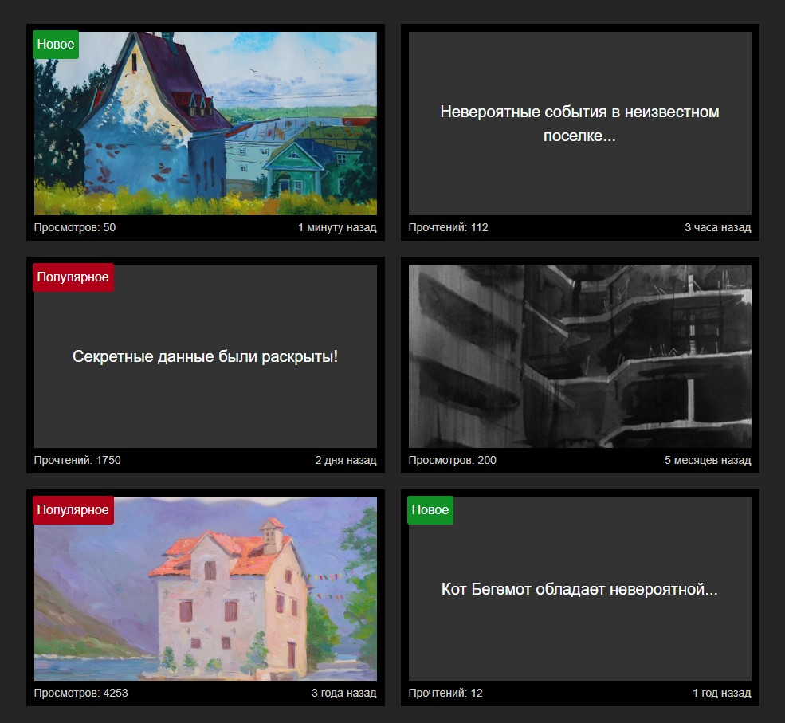

# posts
### Ссылка на прототип:

https://vobiryukov12.github.io/posts/

## Preview

## Описание
Мини-приложение на React, которое форматирует дату публикации и выделяет популярные и новые посты

### Технологии используемые на проекте:

### Возможности приложения:

#### Форматирование даты публикации

У каждой карточки дата публикации изначально задана в формате: `2017-09-01 14:15:10`

Представление даты форматируется следующим образом в зависимости от значения: 
- `X (минуту, минуты, минут)` назад, если прошло меньше часа
- `X (час, часа, часов)` назад, если прошло больше часа
- `X (день, дня, дней)` назад, если больше суток
- `X (месяц, месяца, месяцев)` назад, если прошло больше месяца
- `X (год, года, лет)` назад, если прошло больше года

#### Выделение популярных и новых постов
Популярные статьи и изображения, у которых `1000+` прочтений или просмотров, помечаются лейблом `Популярное`, а с количеством до `100` — `Новое`.

### Особенности проекта:
Для реализации не использовались сторонние библиотеки, только встроенный объект Date.
